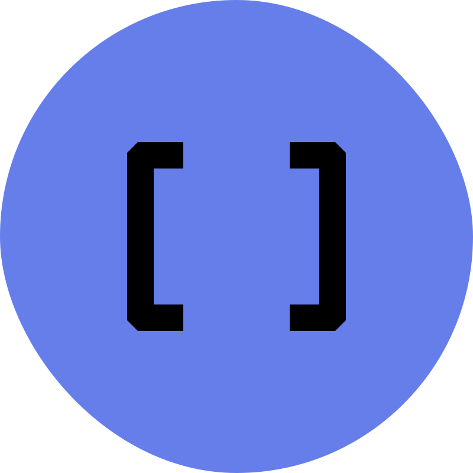

# MyLinkedList 자료구조 시각화

<div align="center">



**JavaScript로 구현한 LinkedList 자료구조 학습 도구**

[](https://developer.mozilla.org/ko/docs/Web/JavaScript)
[](https://developer.mozilla.org/ko/docs/Web/HTML)
[](https://developer.mozilla.org/ko/docs/Web/CSS)
[](LICENSE)

</div>

## 📋 목차

- [🎯 프로젝트 개요](#-프로젝트-개요)
- [✨ 주요 기능](#-주요-기능)
- [🚀 기술 스택](#-기술-스택)
- [📁 프로젝트 구조](#-프로젝트-구조)
- [🛠️ 설치 및 실행](#️-설치-및-실행)
- [📚 사용법](#-사용법)
- [🔧 API 문서](#-api-문서)
- [🎨 시각화 기능](#-시각화-기능)
- [⚡ 성능 최적화](#-성능-최적화)
- [🔄 버전 정보](#-버전-정보)
- [📝 변경 이력](#-변경-이력)
- [🤝 기여하기](#-기여하기)
- [📄 라이선스](#-라이선스)

## 🎯 프로젝트 개요

MyLinkedList는 JavaScript로 구현한 LinkedList 자료구조의 시각적 학습 도구입니다. 
LinkedList의 기본 개념부터 Queue, Stack 구현까지 단계별로 학습할 수 있으며, 
실시간 시각화를 통해 자료구조의 동작 원리를 직관적으로 이해할 수 있습니다.

### 🎓 학습 목표

- **LinkedList 기본 개념** 이해
- **제네릭 프로그래밍** 활용
- **Iterator 패턴** 구현
- **Queue (FIFO)** 자료구조 구현
- **Stack (LIFO)** 자료구조 구현
- **시각적 학습**을 통한 이해도 향상

## ✨ 주요 기능

### 🔗 MyLinkedList 핵심 기능

- ✅ **add()**: 마지막 노드에 데이터 추가
- ✅ **get(index)**: i번째 노드의 데이터 반환
- ✅ **delete(index)**: i번째 노드의 데이터 삭제
- ✅ **제네릭 지원**: 사용 시점에 데이터 타입 지정 가능
- ✅ **Iterator 구현**: for-each 순회 지원
- ✅ **동적 크기 조정**: 런타임에 크기 변경 가능

### 🎨 시각화 기능

- ✅ **실시간 시각화**: LinkedList, Queue, Stack 상태 실시간 표시
- ✅ **애니메이션 효과**: 데이터 추가/삭제 시 부드러운 애니메이션
- ✅ **상태 정보**: 크기, 배열 형태 등 상세 정보 표시
- ✅ **반응형 디자인**: 모바일/태블릿/데스크톱 최적화

### 🎛️ 조작 기능

- ✅ **Queue 조작**: Enqueue, Dequeue, Front 확인
- ✅ **Stack 조작**: Push, Pop, Top 확인
- ✅ **작업 로그**: 모든 작업을 시간과 함께 기록
- ✅ **Iterator 데모**: for-each 순회 기능 시연
- ✅ **키보드 단축키**: 효율적인 조작 지원

## 🚀 기술 스택

### Frontend
- **JavaScript (ES6+)**: 모던 JavaScript 문법 활용
- **HTML5**: 시맨틱 마크업
- **CSS3**: Flexbox, Grid, 애니메이션

## 📁 프로젝트 구조

```
MyLinkedList/
├── index.html              # 메인 HTML 파일
├── MyLinkedList.js         # LinkedList, Queue, Stack 클래스
├── script.js              # UI 로직 및 이벤트 처리
├── style.css              # 스타일시트
├── favicon.svg            # 파비콘
└── README.md              # 프로젝트 문서
```

### 📂 파일별 역할

- **index.html**: 사용자 인터페이스 구조
- **MyLinkedList.js**: 자료구조 클래스 구현
- **script.js**: DOM 조작 및 시각화 로직
- **style.css**: 반응형 디자인 및 애니메이션

## 📚 사용법

### 🔗 MyLinkedList 조작

1. **데이터 추가**
   - "데이터 입력" 필드에 값 입력
   - "Add" 버튼 클릭 또는 Enter 키

2. **데이터 조회**
   - "인덱스" 필드에 조회할 인덱스 입력
   - "Get" 버튼 클릭

3. **데이터 삭제**
   - "인덱스" 필드에 삭제할 인덱스 입력
   - "Delete" 버튼 클릭

### 🎯 Queue 조작

1. **Enqueue**: "데이터 입력" → "Enqueue"
2. **Dequeue**: "Dequeue" 버튼 클릭
3. **Front 확인**: "Front" 버튼 클릭

### 📚 Stack 조작

1. **Push**: "데이터 입력" → "Push"
2. **Pop**: "Pop" 버튼 클릭
3. **Top 확인**: "Top" 버튼 클릭

### ⌨️ 키보드 단축키

- **Enter**: 입력 필드에서 데이터 추가/조회/삭제
- **Ctrl + D**: 데모 데이터 추가
- **Ctrl + L**: 로그 지우기

## 🔧 API 문서

### MyLinkedList 클래스

```javascript
class MyLinkedList {
    // 생성자
    constructor()
    
    // 데이터 추가 (마지막 노드에)
    add(data: T): void
    
    // 데이터 조회 (i번째 노드)
    get(index: number): T
    
    // 데이터 삭제 (i번째 노드)
    delete(index: number): T
    
    // 크기 반환
    getSize(): number
    
    // 비어있는지 확인
    isEmpty(): boolean
    
    // Iterator 구현
    [Symbol.iterator](): Iterator<T>
    
    // 배열로 변환
    toArray(): T[]
    
    // 문자열로 변환
    toString(): string
}
```

### Queue 클래스

```javascript
class Queue {
    // 생성자
    constructor()
    
    // 뒤쪽에 데이터 추가
    enqueue(data: T): void
    
    // 앞쪽에서 데이터 제거 및 반환
    dequeue(): T
    
    // 앞쪽 데이터 확인 (제거하지 않음)
    front(): T
    
    // 비어있는지 확인
    isEmpty(): boolean
    
    // 크기 반환
    size(): number
    
    // 배열로 변환
    toArray(): T[]
}
```

### Stack 클래스

```javascript
class Stack {
    // 생성자
    constructor()
    
    // 맨 위에 데이터 추가
    push(data: T): void
    
    // 맨 위에서 데이터 제거 및 반환
    pop(): T
    
    // 맨 위 데이터 확인 (제거하지 않음)
    top(): T
    
    // 비어있는지 확인
    isEmpty(): boolean
    
    // 크기 반환
    size(): number
    
    // 배열로 변환
    toArray(): T[]
}
```

## 🎨 시각화 기능

### 📊 실시간 시각화

- **LinkedList**: 노드와 포인터를 화살표로 연결하여 표시
- **Queue**: Front(빨간색)와 Rear(초록색)로 구분하여 표시
- **Stack**: Top 요소를 강조하여 세로로 쌓인 구조 표시

### 🎭 애니메이션 효과

- **추가 애니메이션**: 새 요소가 나타날 때 슬라이드 효과
- **삭제 애니메이션**: 요소가 사라질 때 페이드 아웃 효과
- **상태 전환**: 부드러운 트랜지션 효과

### 📱 반응형 디자인

- **모바일**: 세로 레이아웃으로 최적화
- **태블릿**: 2열 그리드 레이아웃
- **데스크톱**: 3열 그리드 레이아웃

### 🔍 핵심 개념

- **노드 (Node)**: 데이터와 다음 노드를 가리키는 포인터를 포함
- **포인터 (Pointer)**: 다음 노드의 메모리 주소를 저장
- **Head**: LinkedList의 첫 번째 노드를 가리키는 포인터
- **제네릭 (Generic)**: 데이터 타입을 런타임에 결정하는 프로그래밍 기법
- **Iterator**: 컬렉션의 요소들을 순회하는 표준화된 방법

## 📞 문의

프로젝트에 대한 문의사항이 있으시면 [Issues](https://github.com/your-username/MyLinkedList/issues)를 생성해 주세요.

---

<div align="center">

**⭐ 이 프로젝트가 도움이 되었다면 Star를 눌러주세요!**

Made with ❤️ by nara9yo
</div>
